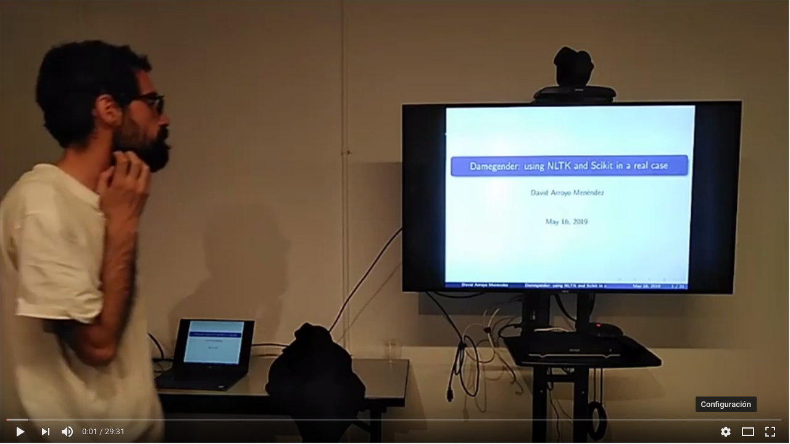
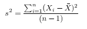
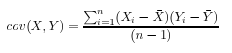
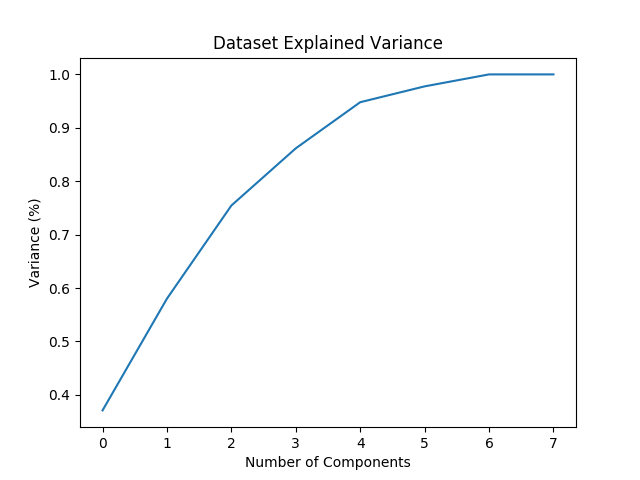

<h2>Table of Contents</h2>

<ul>
<li><a href="#sec-1">1. Logo</a></li>
<li><a href="#sec-2">2. Name</a></li>
<li><a href="#sec-3">3. Why?</a></li>
<li><a href="#sec-4">4. Tell me about DAMe Gender on Youtube</a></li>
<li><a href="#sec-5">5. Install</a>
<ul>
<li><a href="#sec-5-1">5.1. Docker Image</a></li>
<li><a href="#sec-5-2">5.2. Installing Software</a>
<ul>
<li><a href="#sec-5-2-1">5.2.1. Posible Debian/Ubuntu dependencies</a></li>
<li><a href="#sec-5-2-2">5.2.2. From sources</a></li>
<li><a href="#sec-5-2-3">5.2.3. With python package</a></li>
</ul>
</li>
<li><a href="#sec-5-3">5.3. Obtaining an api key</a></li>
<li><a href="#sec-5-4">5.4. Configuring nltk</a></li>
</ul>
</li>
<li><a href="#sec-6">6. Check test</a>
<ul>
<li><a href="#sec-6-1">6.1. All unit tests</a>
<ul>
<li><a href="#sec-6-1-1">6.1.1. Using Docker image</a></li>
</ul>
</li>
<li><a href="#sec-6-2">6.2. Single unit test</a>
<ul>
<li><a href="#sec-6-2-1">6.2.1. Using Docker image</a></li>
</ul>
</li>
<li><a href="#sec-6-3">6.3. Tests from commands</a></li>
</ul>
</li>
<li><a href="#sec-7">7. Execute program</a></li>
<li><a href="#sec-8">8. Benchmarking</a>
<ul>
<li><a href="#sec-8-1">8.1. Market Study</a></li>
<li><a href="#sec-8-2">8.2. Accuracy</a></li>
<li><a href="#sec-8-3">8.3. Confusion Matrix</a></li>
<li><a href="#sec-8-4">8.4. Errors with files/names/all.csv has:</a>
<ul>
<li><a href="#sec-8-4-1">8.4.1. Gender Guesser</a></li>
<li><a href="#sec-8-4-2">8.4.2. Damegender</a></li>
<li><a href="#sec-8-4-3">8.4.3. Namsor</a></li>
</ul>
</li>
<li><a href="#sec-8-5">8.5. Performance</a></li>
</ul>
</li>
<li><a href="#sec-9">9. Statistics for damegender</a>
<ul>
<li><a href="#sec-9-1">9.1. Measuring success and fails</a></li>
<li><a href="#sec-9-2">9.2. PCA</a>
<ul>
<li><a href="#sec-9-2-1">9.2.1. Concepts</a></li>
<li><a href="#sec-9-2-2">9.2.2. Choosing components</a></li>
<li><a href="#sec-9-2-3">9.2.3. Load Dataset</a></li>
<li><a href="#sec-9-2-4">9.2.4. Standarize the data</a></li>
<li><a href="#sec-9-2-5">9.2.5. Pca Projection to N Dimensions</a></li>
<li><a href="#sec-9-2-6">9.2.6. Analize components to determine gender in names</a></li>
</ul>
</li>
</ul>
</li>
<li><a href="#sec-10">10. Speeches, Seminars, Expressions of Support</a></li>
<li><a href="#sec-11">11. Beautiful Snakes</a></li>
<li><a href="#sec-12">12. License</a></li>
</ul>

# Logo

# Name

damegender is a gender detection tool from the name coded by David Arroyo MEnéndez (DAME)

# Why?

-   If you want determine gender gap in free software projects or mailing lists.
-   If you don't know the gender about a name
-   If you want research with statistics about why a name is related with males or females.
-   If you want use a free gender detection tool from a name from a command with
    open data.
-   If you want use the main solutions in gender detection (genderize,
    genderapi, namsor, nameapi and gender guesser) from a command.

DAMe Gender is for you!

# Tell me about DAMe Gender on Youtube

# Install

## Docker Image

    # Build the container image
    $ docker build . -t damegender/damegender:latest
    
    # Run the container
    $ docker run -ti damegender/damegender:latest main.py David

## Installing Software

### Posible Debian/Ubuntu dependencies

    $ sudo apt-get install python3-nose-exclude python3-dev dict dict-freedict-eng-spa dict-freedict-spa-eng dictd

### From sources

    $ git clone https://github.com/davidam/damegender
    $ cd damegender
    $ pip3 install -r requirements.txt

### With python package

    $ python3 -m venv /tmp/d
    $ cd /tmp/d
    $ source bin/activate
    $ pip install --upgrade pip
    $ pip3 install damegender
    $ cd lib/python3.5/site-packages/damegender
    $ python3 main.py David

To install apis extra dependencies:

    $ pip3 install damegender[apis]

To install mailing lists and repositories extra dependencies:

    $ pip3 install damegender[mails_and_repositories]

## Obtaining an api key

Currently you can need an api key from:
-   <https://store.genderize.io/documentation>
-   <https://gender-api.com>
-   <https://www.nameapi.org/>
-   <https://v2.namsor.com/NamSorAPIv2/sign-in.html>

You can execute:

    $ python3 apikeyadd.py

To configure your api key

## Configuring nltk

    $ python3
    >>> import nltk
    >>> nltk.download('names')

# Check test

## All unit tests

    $ nosetest3 test

### Using Docker image

    $ docker run -ti --entrypoint nosetests damegender/damegender:latest test

## Single unit test

    $ nosetests3 test/test_dame_sexmachine.py:TddInPythonExample.test_string2array_method_returns_correct_result

### Using Docker image

    $ docker run -ti --entrypoint nosetests damegender/damegender:latest test/test_dame_sexmachine.py:TddInPythonExample.test_string2array_method_returns_correct_result

## Tests from commands

    $ cd src/damegender
    $ ./testsbycommands.sh         # It must run for you
    $ ./testsbycommandsextra.sh    # You will need api keys!!!!! And to install all software required.

# Execute program

    # Detect gender from a name (INE is the dataset used by default)
    $ python3 main.py David
    David gender is male
     363559  males for David from INE.es
    0 females for David from INE.es
    
    # Detect gender from a name from multiple dataset
    $ python3 main.py David --total="all"
    David gender is male
    375099 males and 9 females from all census (INE + Uk census + USA census)
    
    # Detect gender from a name only using machine learning (experimental way)
    $ python3 main.py Mesa --ml=nltk
    Mesa gender is female
    0 males for Mesa from INE.es
    0 females for Mesa from INE.es
    
    # Find your name in different countries
    $ python3 nameincountries.py David
    grep -i " David " files/names/nam_dict.txt > files/grep.tmp
    males: ['Albania', 'Armenia', 'Austria', 'Azerbaijan', 'Belgium', 'Bosnia and Herzegovina', 'Czech Republic', 'Denmark', 'East Frisia', 'France', 'Georgia', 'Germany', 'Great Britain', 'Iceland', 'Ireland', 'Israel', 'Italy', 'Kazakhstan/Uzbekistan', 'Luxembourg', 'Malta', 'Norway', 'Portugal', 'Romania', 'Slovenia', 'Spain', 'Sweden', 'Swiss', 'The Netherlands', 'USA', 'Ukraine']
    females: []
    both: []
    
    # Count gender from a git repository
    $ python3 git2gender.py https://github.com/chaoss/grimoirelab-perceval.git --directory="/tmp/clonedir"
    The number of males sending commits is 15
    The number of females sending commits is 7
    
    # Count gender from a mailing list
    $ cd files/mbox
    $ wget -c http://mail-archives.apache.org/mod_mbox/httpd-announce/201706.mbox
    $ cd ..
    $ python3 mail2gender.py http://mail-archives.apache.org/mod_mbox/httpd-announce/
    
    # Use an api to detect the gender
    $ python3 api2gender.py Leticia --surname="Martin" --api=namsor
    female
    scale: 0.99
    
    # Google popularity for a name
    $ python3 gendergoogle.py Leticia
    Google results of Leticia as male: 42300
    Google results of Leticia as female: 63400
    
    # Give me informative features
    $ python3 infofeatures.py
    Females with last letter a: 0.4705246078961601
    Males with last letter a: 0.048672566371681415
    Females with last letter consonant: 0.2735841767750908
    Males with last letter consonant: 0.6355328972681801
    Females with last letter vocal: 0.7262612995441552
    Males with last letter vocal: 0.3640823393612928
    
    # To measure success
    $ python3 accuracy.py --csv=files/names/min.csv
    ################### NLTK!!
    Gender list: [1, 1, 1, 1, 2, 1, 0, 0]
    Guess list:  [1, 1, 1, 1, 0, 1, 0, 0]
    Dame Gender accuracy: 0.875
    
    $ python3 accuracy.py --api="genderize" --csv=files/names/min.csv
    ################### Genderize!!
    Gender list: [1, 1, 1, 1, 2, 1, 0, 0]
    Guess list:  [1, 1, 1, 1, 2, 1, 0, 0]
    Genderize accuracy: 1
    
    $ python3 confusion.py
    A confusion matrix C is such that Ci,j is equal to the number of observations known to be in group i but predicted to be in group j.
    If the classifier is nice, the diagonal is high because there are true positives
    Namsor confusion matrix:
     [[2 0 0]
     [0 5 0]
     [0 1 0]]
    Genderize confusion matrix:
     [[2 0 0]
     [0 5 0]
     [0 0 1]]
    Gender Guesser confusion matrix:
     [[2 0 0]
     [0 5 0]
     [0 1 0]]
    Sexmachine confusion matrix:
     [[2 0 0]
     [0 5 0]
     [1 0 0]]
    
    # To analyze errors guessing names from a csv
    $ python3 errors.py --csv="files/names/all.csv" --api="genderguesser"
    Gender Guesser with files/names/all.csv has:
    + The error code: 0.22564457518601835
    + The error code without na: 0.026539047204698716
    + The na coded: 0.20453365634192766
    + The error gender bias: 0.0026103980857080703
    
    # To deploy a graph about correlation between variables
    $ python3 corr.py
    $ python3 corr.py --csv="categorical"
    $ python3 corr.py --csv="nocategorical"
    # To create files from scripts. Example: the pickle models, or csv processed from original files.
    $ python3 postinstall.py
    # Experiments to determine features with weight (not finished)
    $ python3 pca-components.py --csv="files/features_list.csv" # To determine number of components
    $ python3 pca-features.py                                   # To understand the weight between variables for a target

# Benchmarking

## Market Study

<table border="2" cellspacing="0" cellpadding="6" rules="groups" frame="hsides">

<colgroup>
<col  class="left" />

<col  class="left" />

<col  class="left" />

<col  class="left" />

<col  class="left" />

<col  class="left" />

<col  class="left" />
</colgroup>
<tbody>
<tr>
<td class="left">&#xa0;</td>
<td class="left">Gender API</td>
<td class="left">gender-guesser</td>
<td class="left">genderize.io</td>
<td class="left">NameAPI</td>
<td class="left">NamSor</td>
<td class="left">damegender</td>
</tr>

<tr>
<td class="left">Database size</td>
<td class="left">431322102</td>
<td class="left">45376</td>
<td class="left">114541298</td>
<td class="left">1428345</td>
<td class="left">4407502834</td>
<td class="left">57282</td>
</tr>

<tr>
<td class="left">Regular data updates</td>
<td class="left">yes</td>
<td class="left">no</td>
<td class="left">no</td>
<td class="left">yes</td>
<td class="left">yes</td>
<td class="left">yes, developing</td>
</tr>

<tr>
<td class="left">Handles unstructured full name strings</td>
<td class="left">yes</td>
<td class="left">no</td>
<td class="left">no</td>
<td class="left">yes</td>
<td class="left">no</td>
<td class="left">yes</td>
</tr>

<tr>
<td class="left">Handles surnames</td>
<td class="left">yes</td>
<td class="left">no</td>
<td class="left">no</td>
<td class="left">yes</td>
<td class="left">yes</td>
<td class="left">yes</td>
</tr>

<tr>
<td class="left">Handles non-Latin alphabets</td>
<td class="left">partially</td>
<td class="left">no</td>
<td class="left">partially</td>
<td class="left">yes</td>
<td class="left">yes</td>
<td class="left">no</td>
</tr>

<tr>
<td class="left">Implicit geo-localization</td>
<td class="left">yes</td>
<td class="left">no</td>
<td class="left">no</td>
<td class="left">yes</td>
<td class="left">yes</td>
<td class="left">no</td>
</tr>

<tr>
<td class="left">Exists locale</td>
<td class="left">yes</td>
<td class="left">yes</td>
<td class="left">yes</td>
<td class="left">yes</td>
<td class="left">yes</td>
<td class="left">yes</td>
</tr>

<tr>
<td class="left">Assingment type</td>
<td class="left">probilistic</td>
<td class="left">binary</td>
<td class="left">probabilistic</td>
<td class="left">probabilistic</td>
<td class="left">probabilistic</td>
<td class="left">probabilistic</td>
</tr>

<tr>
<td class="left">Free parameters</td>
<td class="left">totalnames, probability</td>
<td class="left">gender</td>
<td class="left">probability, count</td>
<td class="left">confidence</td>
<td class="left">scale</td>
<td class="left">totalnames, count</td>
</tr>

<tr>
<td class="left">Prediction</td>
<td class="left">no</td>
<td class="left">no</td>
<td class="left">no</td>
<td class="left">no</td>
<td class="left">no</td>
<td class="left">yes</td>
</tr>

<tr>
<td class="left">Free license</td>
<td class="left">no</td>
<td class="left">yes</td>
<td class="left">no</td>
<td class="left">no</td>
<td class="left">no</td>
<td class="left">yes</td>
</tr>

<tr>
<td class="left">API</td>
<td class="left">yes</td>
<td class="left">no</td>
<td class="left">yes</td>
<td class="left">yes</td>
<td class="left">yes</td>
<td class="left">future</td>
</tr>

<tr>
<td class="left">free requests limited</td>
<td class="left">yes (200)</td>
<td class="left">unlimited</td>
<td class="left">yes</td>
<td class="left">yes</td>
<td class="left">yes</td>
<td class="left">unlimited</td>
</tr>
</tbody>
</table>

(Checked: 2019/06/27)

## Accuracy

<table border="2" cellspacing="0" cellpadding="6" rules="groups" frame="hsides">

<colgroup>
<col  class="left" />

<col  class="right" />
</colgroup>
<tbody>
<tr>
<td class="left">&#xa0;</td>
<td class="right">Accuracy</td>
</tr>

<tr>
<td class="left">Genderapi</td>
<td class="right">0.9687686966482124</td>
</tr>

<tr>
<td class="left">Namsor</td>
<td class="right">0.7539570378745054</td>
</tr>

<tr>
<td class="left">Genderize</td>
<td class="right">0.715375918598078</td>
</tr>

<tr>
<td class="left">Gender Guesser</td>
<td class="right">0.6902204635387225</td>
</tr>

<tr>
<td class="left">Dame Gender</td>
<td class="right">0.6677501413227812</td>
</tr>
</tbody>
</table>

We are using nltk and INE.es dataset in test. We hope better results
with more languages.

 Machine Learning Algorithms in DameGender
These results are experimental, we are improving the choosing of features.

-   Stochastic Gradient Descendent accuracy: 0.5873374788015828
-   Support Vector Machines accuracy: 0.7049180327868853
-   Gaussian Naive Bayes accuracy: 0.5960994912379876
-   Multinomial Naive Bayes accuracy: 0.5876201243640475
-   Bernoulli Naive Bayes accuracy: 0.5962408140192199
-   Dame Gender (nltk bayes) accuracy: 0.6677501413227812
-   Random Forest accuracy: 0.3364895421141888

## Confusion Matrix

1.  Genderguesser

        [[ 1686, 78, 204]
        [ 139, 3326, 346]]

2.  Genderize

        [[ 1742, 75, 151]
         [ 242, 3157, 412]]

3.  Namsor

        [[ 1686, 78, 204]
         [ 139, 3326, 346]]

4.  Nameapi

        [[ 3126, 93, 592]
         [75, 1616, 277]]

5.  Dame Gender

        [[ 1692, 276, 0]
        [ 778, 3033, 0]]
    
    In this version of Dame Gender, we are not considering decide names as undefined.

## Errors with files/names/all.csv has:

### Gender Guesser

<table border="2" cellspacing="0" cellpadding="6" rules="groups" frame="hsides">

<colgroup>
<col  class="left" />

<col  class="right" />
</colgroup>
<tbody>
<tr>
<td class="left">The error code</td>
<td class="right">0.22564457518601835</td>
</tr>

<tr>
<td class="left">The error code without na</td>
<td class="right">0.026962383126766687</td>
</tr>

<tr>
<td class="left">The na coded</td>
<td class="right">0.2041875757051393</td>
</tr>

<tr>
<td class="left">The error gender bias</td>
<td class="right">0.0030441400304414</td>
</tr>
</tbody>
</table>

The command was:

    $ python3 errors.py --api="genderguesser" --csv="files/names/all.csv"

### Damegender

<table border="2" cellspacing="0" cellpadding="6" rules="groups" frame="hsides">

<colgroup>
<col  class="left" />

<col  class="right" />
</colgroup>
<tbody>
<tr>
<td class="left">The error code</td>
<td class="right">0.18238449558747188</td>
</tr>

<tr>
<td class="left">The error code without na</td>
<td class="right">0.18238449558747188</td>
</tr>

<tr>
<td class="left">The na coded</td>
<td class="right">0.0</td>
</tr>

<tr>
<td class="left">The error gender bias</td>
<td class="right">0.0868662398338813</td>
</tr>
</tbody>
</table>

The command was:

    $ python3 errors.py --api="damegender" --csv="files/names/all.csv"

### Namsor

    $ python3 errors.py --api="namsor" --csv="files/names/all.csv"
    Namsor with files/names/all.csv has:

<table border="2" cellspacing="0" cellpadding="6" rules="groups" frame="hsides">

<colgroup>
<col  class="left" />

<col  class="right" />
</colgroup>
<tbody>
<tr>
<td class="left">The error code</td>
<td class="right">0.13272192420834053</td>
</tr>

<tr>
<td class="left">The error code without na</td>
<td class="right">0.041499330655957165</td>
</tr>

<tr>
<td class="left">The na coded</td>
<td class="right">0.09517217511680222</td>
</tr>

<tr>
<td class="left">The error gender bias</td>
<td class="right">0.011665710460891184</td>
</tr>
</tbody>
</table>

## Performance

-   GenderGuesser accuracy: 0.6902204635387225

real        160m58.742s
user        44m47.532s
sys        0m56.024s

-   Dame Gender accuracy: 0.6677501413227812

real        129m23.082s
user        53m12.640s
sys        0m32.040s

# Statistics for damegender

Some theory could be useful to understand some commands

## Measuring success and fails

To guess the sex, we have an true idea (example: female) and we obtain
a result with a method (example: using an api, querying a dataset or
with a machine learning model). The guessed result could be male,
female or perhaps unknown. Remember some definitions about results
about this matter:

**True positive** is find a value guessed as true if the value in
the data source is positive.

**True negative** is find a value guessed as true if the the
value in the data source is negative.

**False positive** is find a value guessed as false if the the
value in the data source is positive.

**False negative** is find a value guessed as false if the the
value in the data source is negative.

So, we can find a vocabulary for measure true, false, success and
errors. We can make a summary in the gender name context about
mathematical concepts:

**Precision** is about true positives between true positives plus false
positives

    (femalefemale + malemale ) /
    (femalefemale + malemale + femalemale)

**Recall** is about true positives between true positives plus false
negatives.

    (femalefemale + malemale ) /
    (femalefemale + malemale + malefemale + femaleundefined + maleundefined)

**Accuray** is about true positives between all.

    (femalefemale + malemale ) /
    (femalefemale + malemale + malefemale + femalemale + femaleundefined + maleundefinedxs)

The **F1 score** is the harmonic mean of precision and recall taking
both metrics into account in the following equation:

    2 * (
    (precision * recall) /
    (precision + recall))

In Damengender, we are using accuracy.py to apply these concepts. Take
a look to practice:

    $ python3 accuracy.py --api="damegender" --measure="f1score" --csv="files/names/partialnoundefined.csv"
    $ python3 accuracy.py --api="damegender" --measure="recall" --csv="files/names/partialnoundefined.csv"
    $ python3 accuracy.py --api="damegender" --measure="precision" --csv="files/names/partialnoundefined.csv"
    $ python3 accuracy.py --api="damegender" --measure="accuracy" --csv="files/names/partialnoundefined.csv"
    
    $ python3 accuracy.py --api="genderguesser" --measure="f1score" --csv="files/names/partialnoundefined.csv"
    $ python3 accuracy.py --api="genderguesser" --measure="recall" --csv="files/names/partialnoundefined.csv"
    $ python3 accuracy.py --api="genderguesser" --measure="precision" --csv="files/names/partialnoundefined.csv"
    $ python3 accuracy.py --api="genderguesser" --measure="accuracy" --csv="files/names/partialnoundefined.csv"

**Error coded** is about the true is different than the guessed:

    (femalemale + malefemale + maleundefined + femaleundefined) /
    (malemale + femalemale + malefemale +
    femalefemale + maleundefined + femaleundefined)

**Error coded without na** is about the true is different than the
guessed, but without undefined results.

    (maleundefined + femaleundefined) /
    (malemale + femalemale + malefemale +
    femalefemale + maleundefined + femaleundefined)

**Error gender bias** is to understand if the error is bigger guessing
males than females or viceversa.

    (malefemale - femalemale) /
    (malemale + femalemale + malefemale + femalefemale)

**The weighted error** is about the true is different than the guessed,
but giving a weight to the guessed as undefined.

    (femalemale + malefemale +
    + w * (maleundefined + femaleundefined)) /
    (malemale + femalemale + malefemale + femalefemale +
    + w * (maleundefined + femaleundefined))

In Damengeder, we have coded errors.py to implement the different definitions in diffrent apis.

The **confusion matrix** creates a matrix between the true and the
guess. If you have this confusion matrix:

    [[ 2, 0, 0]
     [ 0, 5, 0]]

It means, I have 2 females true and I've guessed 2 females and I've 5
males true and I've guessed 5 males. I don't have errors in my
classifier.

    [[ 2  1  0]
    [ 2 14  0]

It means, I have 2 females true and I've guessed 2 females and I've 14
males true and I've guessed 14 males. 1 female was considered male, 2
males was considered female.

In Damegender, we have coded confusion.py to implement this concept
with the different apis.

## PCA

### Concepts

The dispersion measures between 1 variables are: variance, standard
deviation, &#x2026;

If you have 2 variables, you can write a formula so similar to variance.

If you have 3 variables or more, you can write a covariance matrix.

In essence, an eigenvector v of a linear transformation T is a
non-zero vector that, when T is applied to it, does not change
direction. Applying T to the eigenvector only scales the eigenvector
by the scalar value λ, called an eigenvalue.

A feature vector is constructed taking the eigenvectors that you want
to keep from the list of eigenvectors.

The new dataset take the transpose of the vector and multiply it on
the left of the original data set, transposed.

    FinalData = RowFeatureVector x RowDataAdjust

We can choose PCA using the covariance method as opposed to the
correlation method.

The [covariance method](https://en.wikipedia.org/wiki/Principal_component_analysis#Computing_PCA_using_the_covariance_method) has the next steps:
1.  Organize the data set
2.  Calculate the empirical mean
3.  Calculate the deviations from the mean
4.  Find the covariance matrix
5.  Find the eigenvectors and eigenvalues of the covariance matrix
6.  Rearrange the eigenvectors and eigenvalues
7.  Compute the cumulative energy content for each eigenvector
8.  Select a subset of the eigenvectors as basis vectors
9.  Project the z-scores of the data onto the new basis

The [correlation method](https://www.itl.nist.gov/div898/handbook/pmc/section5/pmc552.htm) has the next steps:
1.  Compute the correlation matrix
2.  Solve for the correlation roots of R (product of eigenvalues)
3.  Compute the first column of the V matrix
4.  Compute the remaining columns of the V matrix
5.  Compute the L(1/2) matrix
6.  Compute the communality
7.  Diagonal elements report how much of the variability is explained
8.  Compute the coefficient matrix
9.  Compute the principal factors

### Choosing components

We can choose components with:

    import numpy as np
    from sklearn.decomposition import PCA
    from sklearn.preprocessing import MinMaxScaler
    import matplotlib.pyplot as plt
    import argparse
    parser = argparse.ArgumentParser()
    parser.add_argument('--csv')
    args = parser.parse_args()
    
    #filepath = 'files/features_list.csv' #your path here
    data = np.genfromtxt(args.csv, delimiter=',', dtype='float64')
    
    scaler = MinMaxScaler(feature_range=[0, 1])
    data_rescaled = scaler.fit_transform(data[1:, 0:8])
    
    #Fitting the PCA algorithm with our Data
    pca = PCA().fit(data_rescaled)
    #Plotting the Cumulative Summation of the Explained Variance
    plt.figure()
    plt.plot(np.cumsum(pca.explained_variance_ratio_))
    plt.xlabel('Number of Components')
    plt.ylabel('Variance (%)') #for each component
    plt.title('Dataset Explained Variance')
    plt.show()

Taking a look to the image. We can choose 6 components.

### Load Dataset

We choose the file all.csv to generate features and a list to determine gender (male or female)

    from pprint import pprint
    import pandas as pd
    import matplotlib.pyplot as plt
    from app.dame_sexmachine import DameSexmachine
    from app.dame_gender import Gender
    
    ## LOAD DATASET
    g = Gender()
    g.features_list2csv(categorical="both", path="files/names/all.csv")
    features = "files/features_list.csv"
    
    print("STEP1: N COMPONENTS + 1 TARGET")
    
    x = pd.read_csv(features)
    print(x.columns)
    
    y = g.dataset2genderlist(dataset="files/names/all.csv")
    print(y)

### Standarize the data

    print("STEP2: STANDARIZE THE DATA")
    from sklearn.preprocessing import StandardScaler
    # Standardizing the features
    x = StandardScaler().fit_transform(x)

### Pca Projection to N Dimensions

Finally, we create the pca transform with 6 dimensions and we add the target component.

    from sklearn.decomposition import PCA
    pca = PCA(n_components=6)
    principalComponents = pca.fit_transform(x)
    print("STEP3: PCA PROJECTION")
    pprint(principalComponents)
    principalDf = pd.DataFrame(data = principalComponents, columns = ['principal component 1', 'principal component 2', 'principal component 3', 'principal component 4', 'principal component 5', 'principal component 6'])
    
    target = pd.DataFrame(data = y, columns = ['target component'])
    
    print(principalDf.join(target))

### Analize components to determine gender in names

<table border="2" cellspacing="0" cellpadding="6" rules="groups" frame="hsides">

<colgroup>
<col  class="right" />

<col  class="right" />

<col  class="right" />

<col  class="right" />

<col  class="right" />

<col  class="right" />

<col  class="right" />
</colgroup>
<thead>
<tr>
<th scope="col" class="right">first\\letter</th>
<th scope="col" class="right">last\\letter</th>
<th scope="col" class="right">last\\letter\\a</th>
<th scope="col" class="right">first\\letter\\vocal</th>
<th scope="col" class="right">last\\letter\\vocal</th>
<th scope="col" class="right">last\\letter\\consonant</th>
<th scope="col" class="right">target component</th>
</tr>
</thead>

<tbody>
<tr>
<td class="right">-0.2080025204</td>
<td class="right">-0.3208958517</td>
<td class="right">0.2352509625</td>
<td class="right">0.2113242731</td>
<td class="right">**0.6095269139**</td>
<td class="right">**-0.6095269139**</td>
<td class="right">-0.1035071139</td>
</tr>

<tr>
<td class="right">**-0.6037951881**</td>
<td class="right">**0.5174873789**</td>
<td class="right">-0.4252467151</td>
<td class="right">0.4278794455</td>
<td class="right">0.0388287435</td>
<td class="right">-0.0388287435</td>
<td class="right">-0.0265942125</td>
</tr>

<tr>
<td class="right">0.1049343046</td>
<td class="right">0.1158117877</td>
<td class="right">-0.2867605971</td>
<td class="right">-0.3473950734</td>
<td class="right">0.0901034539</td>
<td class="right">-0.0901034539</td>
<td class="right">-0.8697264971</td>
</tr>

<tr>
<td class="right">0.2026467275</td>
<td class="right">0.3142402839</td>
<td class="right">**0.630802294**</td>
<td class="right">**0.5325769702**</td>
<td class="right">-0.1291229841</td>
<td class="right">0.1291229841</td>
<td class="right">-0.3811720011</td>
</tr>
</tbody>
</table>

In this analysis, we can observe 4 components.

The first component is about if the last letter is vocal or
consonant. If the last letter is vocal we can find a male and if the
last letter is a consonant we can find a male.

The second component is about the first letter. The last letter is
determing females and the first letter is determing males.

The third component is not giving relevant information.

The fourth component is giving tha lastlettera and the
firstlettervocal is for females.

# Speeches, Seminars, Expressions of Support

-   [MadSeSe](http://gregoriorobles.github.io/MadSESE/201906.html)
-   [Python Barcelona](https://www.meetup.com/es-ES/python-185/events/261405719/)
-   [Taller de Periodismo de Datos (Medialab Prado, Madrid). NLTK & Damegender](https://www.medialab-prado.es/noticias/taller-de-periodismo-de-datos-2019-sesiones-formativas)

# Beautiful Snakes

<table border="2" cellspacing="0" cellpadding="6" rules="groups" frame="hsides">

<colgroup>
<col  class="left" />
</colgroup>
<tbody>
<tr>
<td class="left"></td>
</tr>
</tbody>
</table>

# License

Copyright (C) 2019 David Arroyo Menendez
    Permission is granted to copy, distribute and/or modify this document
    under the terms of the GNU Free Documentation License, Version 1.3
    or any later version published by the Free Software Foundation;
    with no Invariant Sections, no Front-Cover Texts, and no Back-Cover Texts.
    A copy of the license is included in [GNU Free Documentation License](https://www.gnu.org/copyleft/fdl.html).

